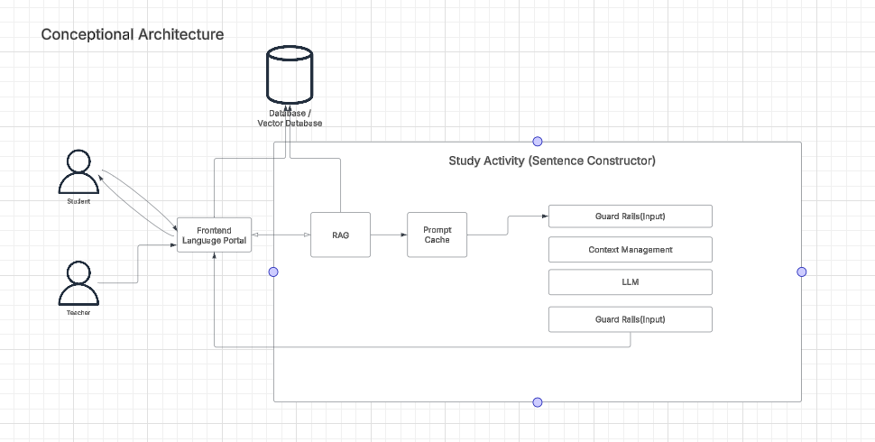

### GenAI Architecture

[Back to Main](../README.md)

## Functional Requirements

The company intends to take ownership of its infrastructure due to concerns about user data privacy and the potential for rising costs of managed GenAI services.
They plan to invest in an **AI workstation** with a budget of  **$10,000 to $15,000** , ensuring it can support **300 active students** based in the city of  **Osaka** .

## Assumptions

The **selected open-source LLMs** will be capable of running efficiently on a **$10K–$15K budget** and will handle requests from **300 students** with a **single internet-connected server** providing sufficient bandwidth.
The **total cost of ownership** will be more economical than managed services, and the institution will have the necessary **technical staff** to support the system.
All required **learning materials** will be legally sourced and stored to avoid copyright issues, and the selected models (e.g.,  **IBM Granite** ) will provide transparency in training data to ensure compliance with  **data privacy regulations** .

## Data Strategy

Due to concerns over copyrighted materials, it is essential to **procure and legally acquire** all necessary content.
This content will then be **stored securely** in a dedicated database for easy and controlled access by users.
We will ensure that all materials are properly **licensed** and compliant with copyright laws to avoid any legal issues.
Furthermore, we will implement **clear data management policies** to organize, track, and monitor these resources, ensuring their availability while maintaining  **data integrity and security**.
By managing and storing all content in-house, we will also retain full **control over data privacy** and  **access rights** .

## Considerations

We're considering using IBM Granite because its a truley open-source model with training data that is traceable so we can avoid any copyright issues and we are able to know what is going on in the model.

[https://huggingface.co/ibm-granite](https://huggingface.co/ibm-granite)
